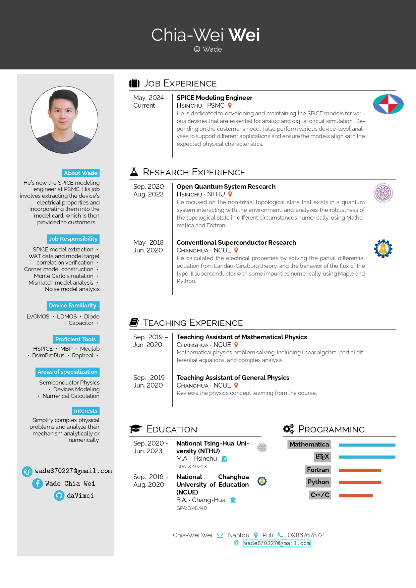

 

Hello, my name is Wade, and I'm a SPICE modeling engineer at Powerchip Semiconductor Manufacturing Corporation (PSMC). I hold a master’s degree in physics from National Tsing Hua University (NTHU). In my role, I am responsible for developing and maintaining SPICE models for semiconductor devices, ensuring their accuracy and reliability in circuit simulations. The devices I work with include MOSFETs, BJTs, diodes, and other semiconductor components. My expertise lies in the intricate details of semiconductor physics, which allows me to create precise model card that reflect the real-world behavior of these devices.

## Job Experience

<table style="width:99%;">
<tr>
<td>&#8226; Powerchip Semiconductor Manufacturing Corporation &#160;&#160;(PSMC)</td>
<td> 2024/05-Current</td>
</tr>
</table>

## Education

<table style="width:95%;">
<tr>
<td>&#8226; Ming-Doa High School (MDHS)</td>
<td>2013/09-2016/08</td>
</tr>
<tr>
<td>&#x2022; National Changhua University of Education (NCUE)</td>
<td>2016/09-2020/08</td>
</tr>

<tr>
<td>&#x2022; National Tsing-Hua University (NTHU)</td>
<td>2020/09-2023/07</td>
</tr>
</table>

## Teaching Assistant Experience

<table style="width:99%;">
<tr>
<td>&#8226; General Physics (Undergruate course)</td>
<td>2019/09-2020/06</td>
</tr>
<tr>
<td>&#x2022; Mathematical Physics (Undergruate course)</td>
<td>2019/09-2020/06</td>
</tr>
</table>

## Program Language

<ul class="skill-list">
	<li>Fortran (Intermediate): For effecient numerical calculation.</li>
	<li>Mathematica (Intermediate): For symbolic calculation.</li>
	<li>Latex (Intermediate): For writting paper ,thesis and slides.</li>
        <li>Python (Intermediate): For numerical calculation with package.</li>
        <li>C/C++ (Beginner): For fun.</li>
</ul>

## My CV

