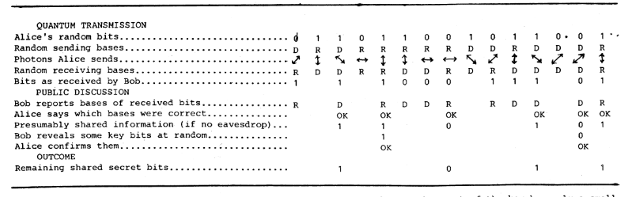
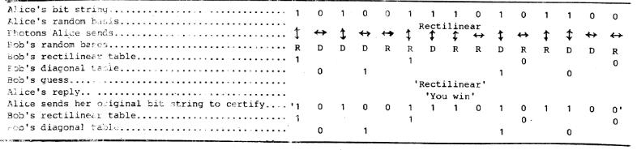

## Quantum cryptography protocol BB84

BB84 is the quantum key distribution scheme which developed by Charles Bennett and Gilles Brassard in 1984. The name of BB84 originates from the prefix-alphabet of the name of these two scientists, “B” to “Bennett” and “Barassard”, “84” from the year of the paper is proposed.

) ](./Untitled.png "[Dr. Charles H. Bennett](https://en.wikipedia.org/wiki/Charles_H._Bennett_(physicist)), who is known for quantum teleportation and quantum cryptography and was awarded the breakthrough prize in fundamental science in 2023.")

](./Untitled1.png "[Gilles Grassard](https://en.wikipedia.org/wiki/Gilles_Brassard), who is known for quantum cryptography and quantum teleportation and also was awarded the breakthrough prize in fundamental science in 2023.")

This protocol is designed for the one-time pad (OTP) encryption technique. Based on the no-clone theorem and superposition property of the quantum states, we can avoid any disturbance from stealing any information during the process of private key communication. That is the reason why that it relies on two condition (a) there should exist the authenticated classical channel to verify the properties from the private key communication, and (b) it requires that the information gain is only possible when disturbing basis is not orthogonal to information.

## One-Time Pad Encryption

In cryptography, there are two types of encryption: symmetric and asymmetric encryption. Suppose Alice want to send the message to Bob by encryption. She can encrypt the message by a sequence of operations to encode it into scrambled characteristics (ciphertext), then send it to Bob. For the symmetric encryption, it means that if Bob would like to decode the ciphertext, he should perform the same operations which is so-called the “_key_” on them. However, for asymmetric encryption, the *key*s are different from Alice and Bob.

### Security

The security of this one-time pad encryption had been proved by Claude Shannon in 1949. If the following conditions are met, it’s hard to decode the ciphertext:

1. The key must be long as the message (plaintext).
2. The key should be generated randomly from chaotic and uncertain source
3. The key only be used once and should be destroyed after communication.
4. The key should be kept completely secret.

### Example

Suppose Alice want to send the message “`Hello`” to Bob. First, she can encode these words into the binary expression which can be shown as:

```bash
01001000 01100101 01101100 01101100 01101111  --palintext
```

Use the random generated ciphertext which both sides agree with to encrypt the message:

```bash
00101011 01100101 01110100 00110110 00011110  --private key
```

Then, Alice can apply the “**XOR**” operation on these two binary sequences that she obtains:

```bash
    01001000 01100101 01101100 01101100 01101111
XOR 00101011 01100101 01110100 00110110 00011110
----------------------------------------------------
    01100011 00000000 00011000 01011010 01110001  --ciphertext
```

Finally, Alice can send ciphertext to Bob without any concern. Even though eavesdropper retrieve the message during the communication, but he still can’t decode this ciphertext without the private key. That’s why Alice and Bob should keep the key completely secret to prevent eavesdropper decoding the message. As Bob receiving the message, he just performs the same operation on the ciphertext then he can get the correct information from Alice.

## Description





🚧 To Be Continued...

## Reference

[1] The original paper of the BB84 and quantum coin tossing protocol. [https://web.archive.org/web/20200130165639/http://researcher.watson.ibm.com/researcher/files/us-bennetc/BB84highest.pdf](https://web.archive.org/web/20200130165639/http://researcher.watson.ibm.com/researcher/files/us-bennetc/BB84highest.pdf)
