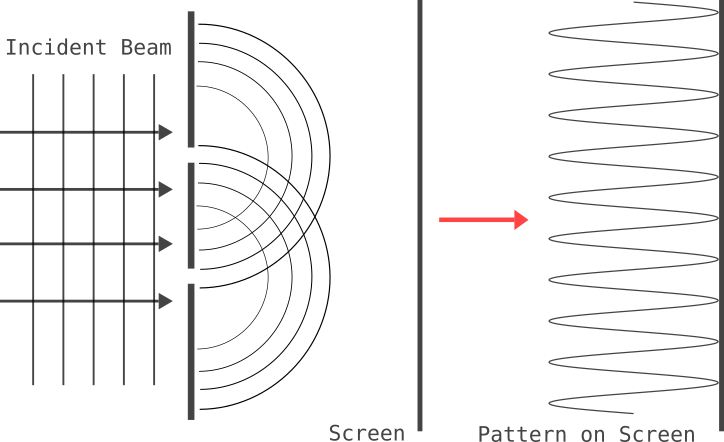
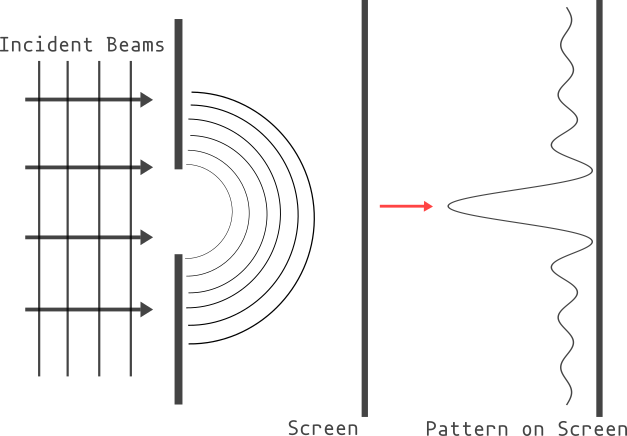



## Introduction

The **interference effect**, produced by the superposition of the two or more individual coherent beam of the light, which is originated from the light can be explained by the wave character of light. Given a light source passes through a hole on the opaque screen, we can observe the "interference pattern", which is involved in the **diffraction** of the light, on the viewing screen easily. To describe the diffraction of light, it can be regarded as any deviation from the geometric optics, that resulting from the obstruction of a wavefront of light.

According to the [**Huygens-Fresnel principle**][Huygens], which pointed out that every point of a given wavefront of light can be considered as a source of secondary spherical wavelet. Thus, at some point on the viewing screen, every point emerges from a hole on the opaque screen, which the light pass through, as an array of source of wavelets whose superposition produces the resultant filed. As we mention an array of light source pass through a hole, we should note that diffraction is distinguished from the interference on this basis. In the diffraction phenomena, the interfering beams originate from a continuous distribution of beams; in interference phenomena, the interfering beams originate from a discrete number of sources. Thence, we will found that the pattern produced by the diffraction is different from the pattern produced by the interference[1].

## Diffraction from a single slit

In this section, I will give an explicit derivation of the diffraction pattern produced by a single slit. The light source is assumed to be monochromatic, and the slit is assumed to be infinitely long in the y-direction and of width \\(a\\) in the x-direction. The light source is assumed to be at a distance \\(D\\) from the slit, and the viewing screen is at a distance \\(L\\) from the slit. The coordinate system is shown in the figure below.

To Be Continued...

## Reference

[Huygens]: https://en.wikipedia.org/wiki/Huygens%E2%80%93Fresnel_principle "wiki of Huygens-Fresnel principle"

[1] F. L. Pedrotti, L. M. Pedrotti, and L. S. Pedrotti, Introduction to Optics, 3rd ed. Cambridge: Cambridge University Press, 2017.
